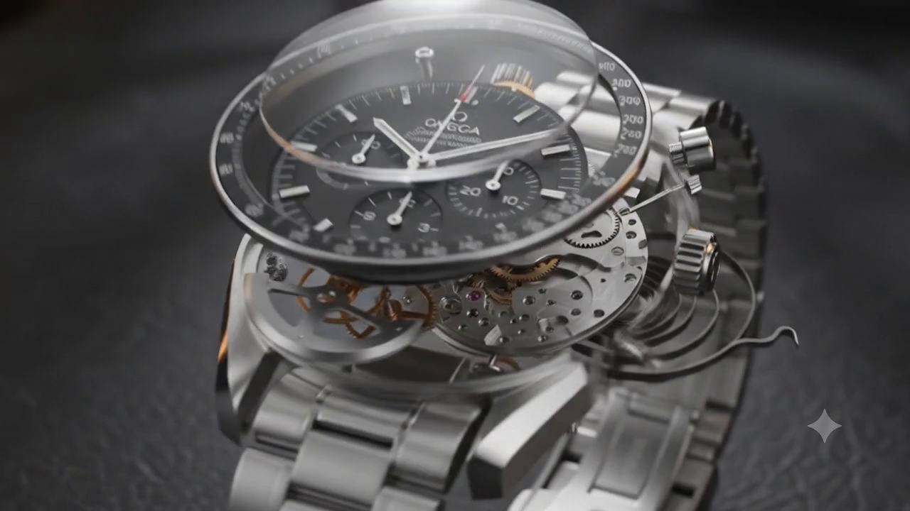

# AURELIUS ORA | Haute Horlogerie



A high-end, Versace-inspired luxury watch e-commerce landing page built with React, Vite, and Tailwind CSS. The website is designed to deliver a premium, seamless user experience featuring glassmorphism, rich animations, and an ultra-smooth parallax scroll architecture.

**🌐 Live Demo:** [https://demo-watch-website-theta.vercel.app/](https://demo-watch-website-theta.vercel.app/)

## ✨ Key Features

- **Seamless Parallax Hero:** A stunning, gapless `100vh` hero section powered by Framer Motion.
- **Luxury Glassmorphism Aesthetic:** Dark glass UI elements with subtle gold hover glows that emulate the high-fashion luxury feel.
- **Dynamic Scroll Animations:** Content elegantly fades and slides into view as the user navigates the page.
- **Responsive Layout:** Perfectly tailored padding and components that look gorgeous on both desktop and mobile devices.
- **Interactive Showcases:** Includes a Men's Collection, Women's Collection, and a detailed Masterpiece Showcase with Quick View modal capabilities.

## 🛠️ Technology Stack

- **Framework:** React + Vite
- **Styling:** Tailwind CSS
- **Animations:** Framer Motion
- **Icons:** Lucide React

## 🚀 Getting Started

To run this project locally, follow these steps:

1. **Clone the repository**
   ```bash
   git clone https://github.com/VaishnavSreejan/Demo-Watch-Website.git
   ```

2. **Navigate to the project directory**
   ```bash
   cd Demo-Watch-Website
   ```

3. **Install dependencies**
   ```bash
   npm install
   ```

4. **Start the development server**
   ```bash
   npm run dev
   ```

5. **View in browser**
   Open `http://localhost:3000` (or the port specified by Vite) to view the site.

## 📜 License

This is a demo project created for portfolio and educational purposes. The brand "Aurelius Ora" and associated assets are fictional.
